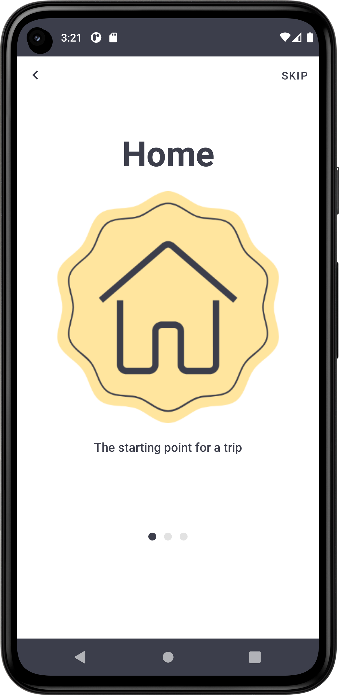

# ComposeOnBoarding
> <b>Author: Nicola De Nicolais</b>

## 📍 Description
Android application built with Kotlin and Jetpack Compose that shows how create an Onboarding component in Compose.

## 🛠️ Package Structures

```
com.denicks21.roomdatabase      # Root Package
├── di                          # DI folder
│   ├── AppModule               # Inject repository in the constructor.
|
├── navigation                  # Navigation folder
│   ├── NavGraph                # Contains all of app destinations and actions.
│   └── NavScreens              # Contains a sealed class with object corresponds to a screen and its routes.
|
├── repository                  # Repository folder
│   ├── DataStoreRepository     # Repository to access Dao.
|
├── screen                      # App screens folder
|   │   ├── HomePage            # Main page of the app. It appear after clicking the final button.
|   │   ├── IntroPage           # Splashscreen of the app.
|   │   ├── OnBoardingPage      # Page containing onboarding structure.
│
├── ui                          # UI resources folder
│   ├── composables             # Composable components
|   │   ├── CustomBackPress     # Component that control and prevent back button action.
|   │   ├── FinishButton        # Button that completes the onboarding.
|   │   ├── TopComponent        # Top bar of onboarding component.
|
├── theme                       # Theme components folder
|   │   ├── Color               # Color palette used by the app.
|   │   ├── Shape               # Components shapes of Compose used by the app.
|   │   ├── Theme               # Theme used by the app.
|   │   ├── Type                # Typography styles for the fonts used by the app.
|
├── viewmodels                  # ViewModel folder
|   │   ├── HomeViewModel       # Model that interact with repository class.
|   │   ├── IntroViewModel      # Model that interact with repository class.
├── MainActivity                # Main activity
├── OnBoarding                  # Trigger Hilt's code generation.
```

## 📎 Screenshots
<p float="left">


