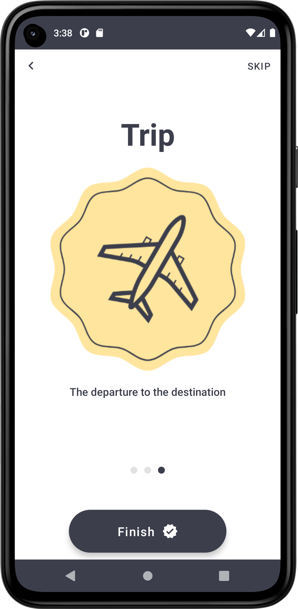

# ComposeOnBoarding
> <b>Author: Nicola De Nicolais</b>

## 📍 Description
Android application built with Kotlin and Jetpack Compose that shows how create an Onboarding component in Compose.

## ⚡ Structure
### Tech Stacks
#### Dagger Hilt

Hilt is a dependency injection library for Android that reduces the boilerplate of doing manual dependency injection in your project. Hilt provides a standard way to use DI in your application by providing containers for every Android class in your project and managing their lifecycles automatically. Hilt is built on top of the popular DI library Dagger to benefit from the compile-time correctness, runtime performance, scalability, and Android Studio support that Dagger provides.

### Jetpack Compose
#### Navigation

Navigation refers to the interactions that allow users to navigate across, into, and back out from the different pieces of content within your app. Android Jetpack's Navigation component helps you implement navigation, from simple button clicks to more complex patterns, such as app bars and the navigation drawer.

#### ViewModel

The ViewModel class is a business logic or screen level state holder. It exposes state to the UI and encapsulates related business logic. Its principal advantage is that it caches state and persists it through configuration changes. This means that your UI doesn’t have to fetch data again when navigating between activities, or following configuration changes, such as when rotating the screen.

## 🛠️ Package Structures

```
com.denicks21.roomdatabase      # Root Package
├── di                          # DI folder
│   ├── AppModule               # Inject repository in the constructor.
|
├── navigation                  # Navigation folder
│   ├── NavGraph                # Contains all of app destinations and actions.
│   └── NavScreens              # Contains a sealed class with object corresponds to a screen and its routes.
│   └── OnBoardingScreens       # Contains a sealed class with object corresponds to the onboarding's screen and its routes.
|
├── repository                  # Repository folder
│   ├── DataStoreRepository     # Repository to access Dao.
|
├── screen                      # App screens folder
|   │   ├── HomePage            # Main page of the app. It appear after clicking the final button.
|   │   ├── IntroPage           # Splashscreen of the app.
|   │   ├── OnBoardingPage      # Page containing onboarding structure.
│
├── ui                          # UI resources folder
│   ├── composables             # Composable components
|   │   ├── CustomBackPress     # Component that control and prevent back button action.
|   │   ├── FinishButton        # Button that completes the onboarding.
|   │   ├── TopElements         # Top elements of onboarding component.
|
├── theme                       # Theme components folder
|   │   ├── Color               # Color palette used by the app.
|   │   ├── Shape               # Components shapes of Compose used by the app.
|   │   ├── Theme               # Theme used by the app.
|   │   ├── Type                # Typography styles for the fonts used by the app.
|
├── viewmodels                  # ViewModel folder
|   │   ├── HomeViewModel       # Model that interact with repository class.
|   │   ├── IntroViewModel      # Model that interact with repository class.
├── MainActivity                # Main activity
├── OnBoarding                  # Trigger Hilt's code generation.
```

## 📎 Screenshots
<p float="left">



